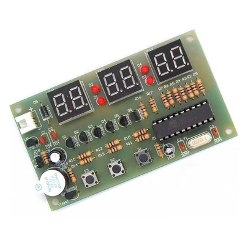
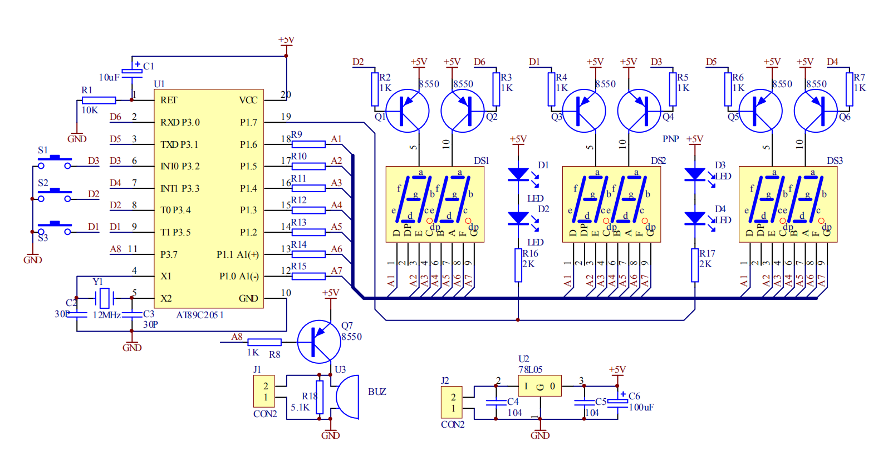

# AT89C2051-based, 6-digit clock firmware

## Introduction

A few months ago, someone asked my help in fixing this 6-digit digital clock kit
they had assembled. After soldering all the components, inserting the IC and
connecting the power supply, nothing happened. They found
[this video on YouTube](https://www.youtube.com/watch?v=OIdR2x1GxLo), explaining
that, instead of executable binary instructions, the microcontroller probably
contained part of the clock program's source code. Or even no programming at all!

So, the video's creator [Ruthsarian](https://github.com/ruthsarian) went on and
wrote their own firmware in C and published the project
[on Github](https://github.com/ruthsarian/at89c2051_clock). My project is
based on this work.

## Customizations

The DIY soldering kit is available from, among others, [AliExpress][522] and
[Alibaba][523]. The original project used the same microcontroller, but had four
digits &ndash; this kit had six.

Being a programmer, but having no practical experience in assembler or C, I
managed to increase display count from 4 to 6 by studying both kit's schematics.
They differ in which of the chip's outputs select the display segments, and in
which output controls the (blinking) colons between hours and minutes, minutes
and seconds respectively. Finally, the button inputs differed, too.

*Original 4-digit clock schematic*

*6-digit clock schematic*

As advised by Ruthsarian, I compiled the source using [SDCC version 3.5.0][457].
Any newer version increased the compiled size to more than 2048 bytes &ndash;
the chip's maximum ROM capacity.

## Features

- Display HH:MM:SS
- Set time hour, time minute
- Set alarm hour, alarn minute
- Enable/disable alarm
- Blinking colons (1/2 second on, 1/2 second off)

- drop 12/24 hour support
- drop timer function

## Operation

There are three buttons, but only the two rightmost are used in this project.

Short B2 presses cycle through displaying the current time in HH:MM and MM:SS format as well as the 12/24-hour display format option. A short B1 press while on the 12/24-hour display format will toggle the setting. A short B2 press will then enter the timer mode. A short B1 press will toggle the start/stop of the timer. A long B2 press will reset the timer. The timer will continue to increment (if running) even when cycling through other modes. Timer currently resets after 60 minutes.

A long B1 press while viewing the current time in HH:MM format will enter the set time mode. The hours section will begin to blink. Short B2 presses will increment the hour by 1. Holding B2 down will cause the clock to increment quickly after 1 second. A short B1 press will then move to the minutes where operation is similar to setting the hour. Another B1 press will exit set time mode and the clock will return to display the current time.

Short B1 presses cycle through setting and enabling the alarm. When viewing the currently set alarm time, the display will blink. This is done to differentiate between viewing the current time and the currently set alarm time. While viewing the alarm time, a long press of B1 will enter the set alarm mode, at which point only the digits being set will blink. Setting the alarm is similar to setting the current time.

A short B1 press while viewing the alarm or exiting out of setting the alarm will enter the enable/disable alarm mode. A short B2 press will toggle this setting. A short B1 press exist to the display current time mode.

## Programming the AT89C2051

I have been using an [SP200S-V2.0 programmer][144] to flash the compiled `.hex`-file
into the AT89C2051 microcontroller. Finding the right software to do that was a
challenge, but I eventually ended up using a virtual machine running Windows 10.
In there, I installed the flash tool [WL-Pro V220][633]. Additional drivers for
the serial port were not necessary; Windows already recognized the programmer's
`CH340` chip out of the box.

## References

- [AT89C2051 datasheet](http://ww1.microchip.com/downloads/en/DeviceDoc/doc0368.pdf)

[457]: https://sourceforge.net/projects/sdcc/files/sdcc/3.5.0/
[522]: https://aliexpress.com/item/1005001671051111.html
[523]: https://www.alibaba.com/suppliersubdomainalibabacom/product-detail/I-1600154086618.html
[144]: https://aliexpress.com/item/1005005921400025.html
[633]: https://w.electrodragon.com/w/USB-TTL_Programmer
